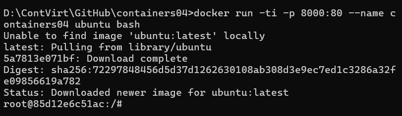
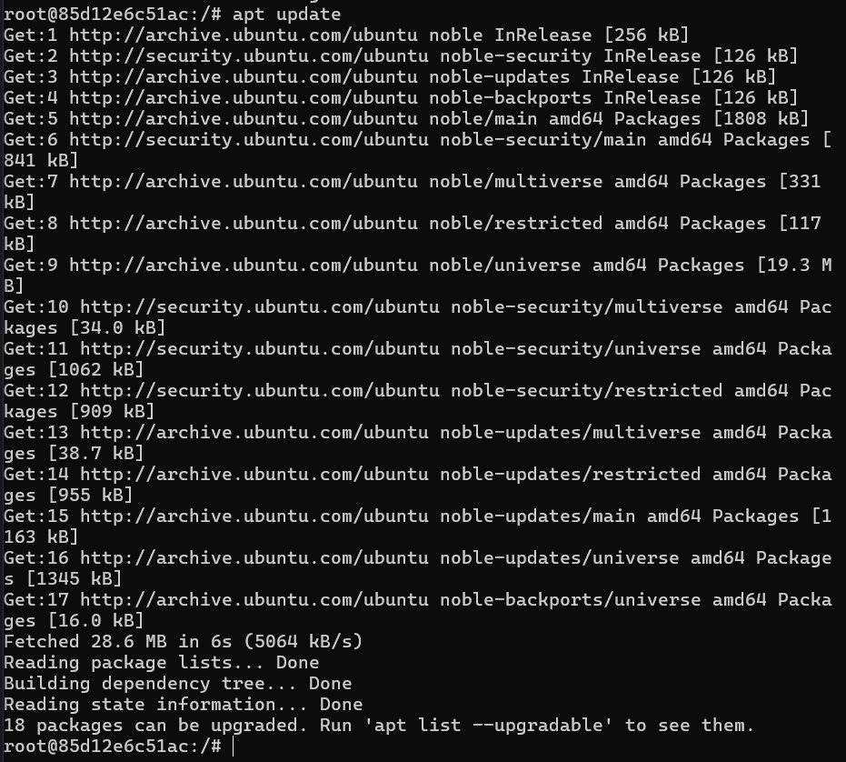
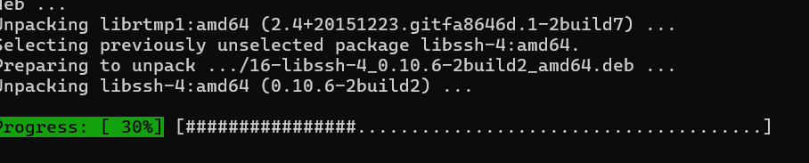
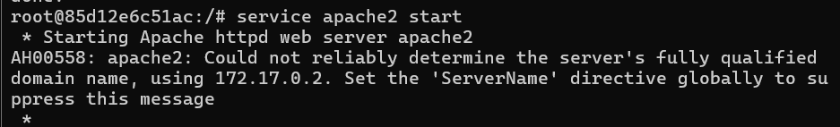
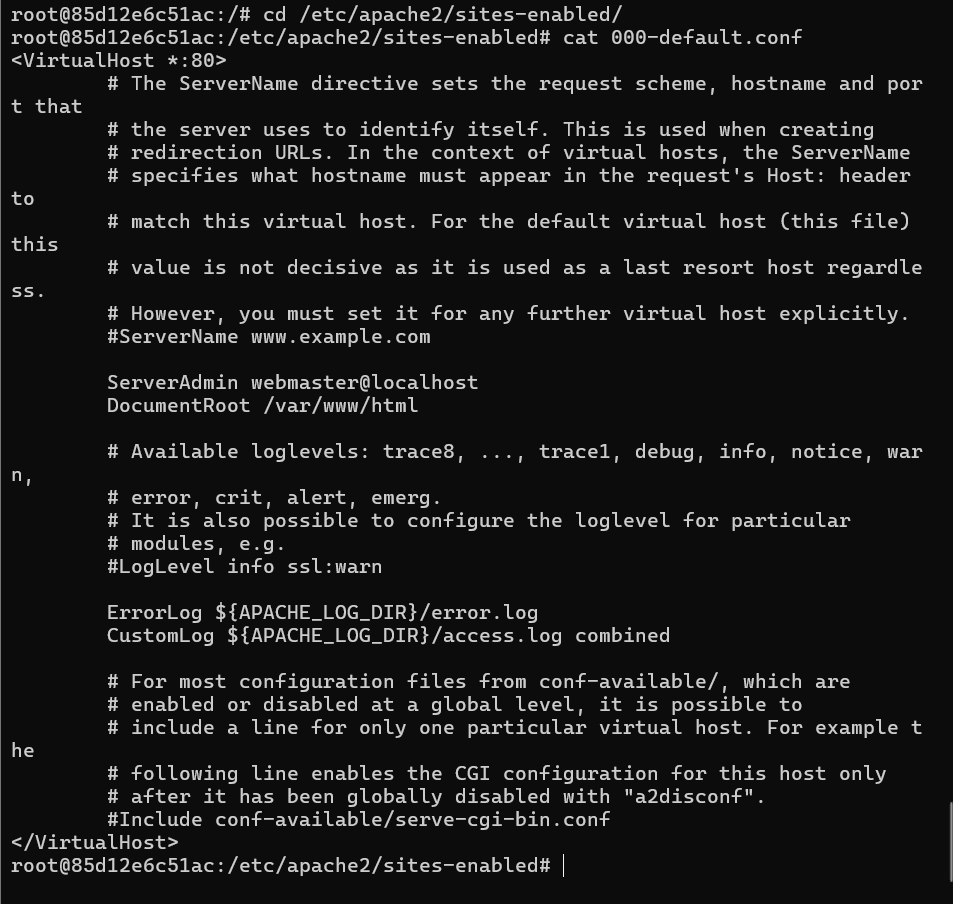
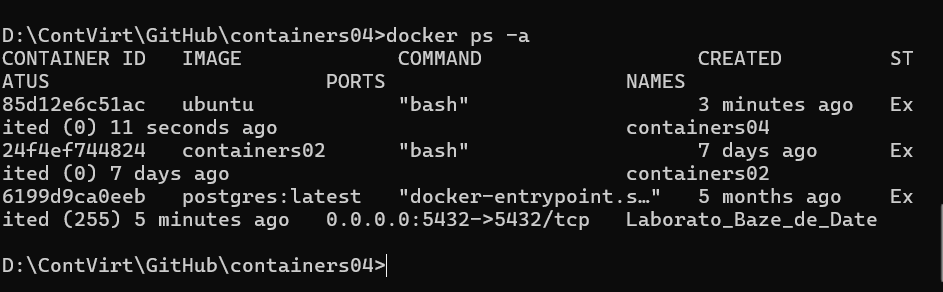

# Lucrare de laboraotr nr.4
## Tema : Utilizarea containerelor ca medii de execuție
### Scop:
Această lucrare de laborator are ca scop familiarizarea cu comenzile de bază ale `OS Debian/Ubuntu`. De asemenea, aceasta va permite să vă familiarizați cu `Docker` și comenzile sale de bază.
### Sarcina:
Pornind de la imaginea oficială a sistemului de operare `Ubuntu`, să se creeze un container care să conțină un server web `Apache`. Să se creeze o pagină web care să conțină textul `"Hello, World!"` și să se afișeze într-un browser.
### Executare:
Pentru inceput am creat un director `conatiners04`. In continuare eu intru in terminal(cmd) si intru in direcotrul `conatiners04`. In acest directoriu scriu comanda:

```sh
docker run -ti -p 8000:80 --name containers04 ubuntu bash
``` 
Aceasat comanda porneste un container de tip docker si-l ruleaza prin secventa `docker run`, care in continuare activeaza modul interactiv a acestuia prin `-ti`. Prin `-p 8000:80` am mapat portul , unde `8000` wste portul masinii locale , care este conectata la portul `80` al conatinerului. Specific denumirea containerului si imaginea Docker-ului care o vom folosi prin secventa `--name containers04 ubuntu`, ce ne explica ca containerul va fi pe baza SO `Ubuntu`. In final am rulat shell-ul in interiorul containerului prin `bash`.  



In continuare se va deschide in terminal fereastra shell ubuntu, in care noi introducem urmatoarele comenzi:
```sh
apt update
apt install apache2 -y
service apache2 start
```
Prima linie de comanda actualizeaza pachetele disponibile pentru Ubuntu de pe serverele sale. A doua linie de comanda este pentru a instala serverul Apache. prin ultima comanda eu am pornit serverul apache, pentru a raspunde la comenzile HTTP.




#### Deschideți browserul și introduceți în bara de adrese http://localhost:8000. Ce vedeți?
Deschizand adresa data am intrat pe o fereastra defautl a `Apache2`.

In continuare executand comenzile date:
```sh
ls -l /var/www/html/
echo '<h1>Hello, World!</h1>' > /var/www/html/index.html
```
si reimprospatand pagina web sa afisat ceea ce era scris in `echo`


Executand in continuare comenzile `cd /etc/apache2/sites-enabled/`, si `cat 000-default.conf` im afiseaza informatie despre host-ul virtual ce se afla pe portul 80 , in care se afla adresa de email a administratorului (`ServerAdmin webmaster@localhost`), directorul unde se afla toate fisisierlie a site-ului ce a fost dat de Apache (`DocumentRoot /var/www/html`). De asemenea avem si multe alte fisiere ca `ErrorLog ${APACHE_LOG_DIR}/error.log`, `CustomLog ${APACHE_LOG_DIR}/access.log combined` care sunt pentru erori si accesari.


In final am afisat lista de containere prin `docker ps -a` si dupa am sters containerul `containers04`.


### Concluzie
In urma acestei lucrari de laborator, am studiat cum utilizan containerele docker ca mediu de executie,prin configurarea unui server web si instalare unui conatiner bazat pe imaginea Ubuntu.Am pornit un container nou, am instalat și pornit Apache, apoi am creat o pagină web simplă care afișa mesajul "Hello, World!". Prin maparea porturilor, am reușit să accesăm această pagină web în browser, demonstrând astfel funcționalitatea serverului web într-un mediu izolat.De asemenea, am analizat fișierul de configurare al Virtual Host pentru a înțelege cum Apache gestionează cererile HTTP și am verificat starea containerelor Docker. În final, am oprit și șters containerul creat.