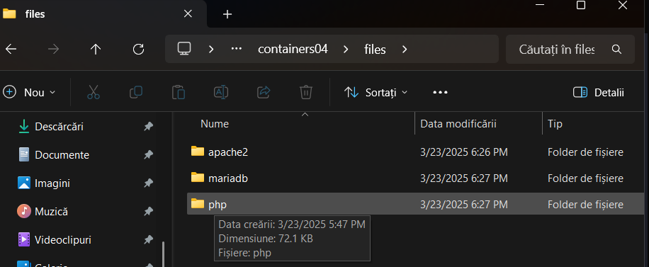
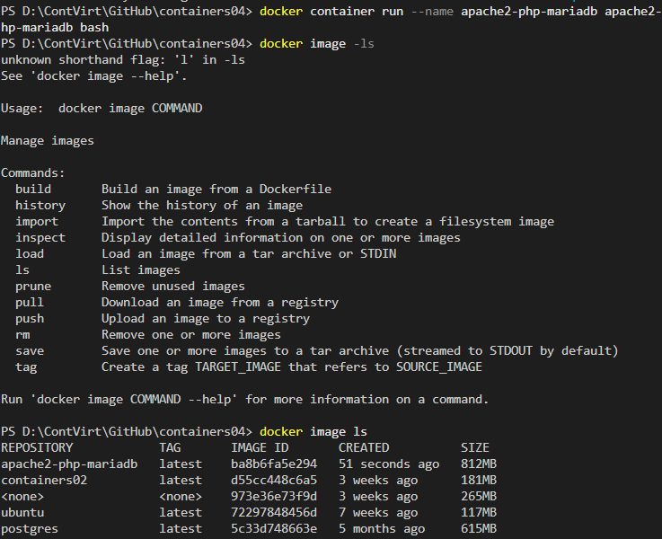
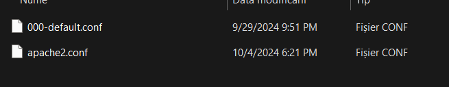
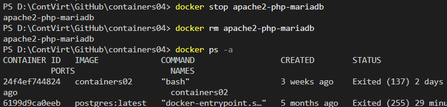

# containers04
# Lucrarea de laborator numarul 5
### <i>Tema:</i> Rularea site-ului într-un container
### <i>Data:</i>23.03.2025 

## I. Scopul lucrării
Învățarea studentului de a pregăti un container, pentru a rula pe acesta un site web, bazat pe Apache HTTP Server + PHP (mod_php) + MariaDB.

## II. Sarcina
Crearea unui fișier `Dockerfile` pentru a construi o imagine a containerului care va conține un site web bazat pe `Apache HTTP Server` + `PHP` (mod_php) + `MariaDB`. Baza de date MariaDB trebuie să fie stocată într-un volum montat. Serverul trebuie să fie disponibil pe portul `8000`.

Instalați site-ul `WordPress`. Verificați funcționarea site-ului.

## III. Executarea lucrării 
Am creat un nou repositoriu `containers04` si l-am clonat pe dekstop. Am creat in el folderul `files` si in el am creat in 3 foldere pentru apache2 , mariadb si php


In direcotorul `containers04` am creat fisierul `Dockerfile` cu urmatorul continut:
```dockerfile
# create from debian image
FROM debian:latest

# install apache2, php, mod_php for apache2, php-mysql and mariadb
RUN apt-get update && \
    apt-get install -y apache2 php libapache2-mod-php php-mysql mariadb-server && \
    apt-get clean
```

In continuare, in terminal in directoriul dat prin comanda `docker image build -t apache2-php-mariadb . ` am creat imaginea containerului `apache2-php-mariadb`.


Creez un container `apache2-php-mariadb` din imaginea `apache2-php-mariadb` și pornesc în modul de fundal cu comanda bash.


Cu ajutorul la comandele:
```sh
docker cp apache2-php-mariadb:/etc/apache2/sites-available/000-default.conf files/apache2/
docker cp apache2-php-mariadb:/etc/apache2/apache2.conf files/apache2/
docker cp apache2-php-mariadb:/etc/php/8.2/apache2/php.ini files/php/
docker cp apache2-php-mariadb:/etc/mysql/mariadb.conf.d/50-server.cnf files/mariadb/
```
am copiat din conatiner fisierele de configurare apache2, php, mariadb în directorul files/ de pe computer.


Cand m-am asigurat ca totul sa copiat cu succes am oprit si dupa am sters containerul `apache2-php-mariadb`.


## IV. Configurarea
### Fișierul de configurare apache2
Deschid fisierul `files/apache2/000-default.conf`, gasesc linia `#ServerName www.example.com` si sa o inlocuiesc cu `ServerName localhost`. Dupa gasesc linia `ServerAdmin webmaster@localhost` si imi rescriu adresa mea de e-mail si dupa linia ` DocumentRoot /var/www/html` adaug din linie noua: `DirectoryIndex index.php index.html`


La sfârșitul fișierului `files/apache2/apache2.conf` adaug următoarea linie: `ServerName localhost`.

### Fișierul de configurare php
Deschid fisierul `files/php/php.ini`, am gasit linia `;error_log = php_errors.log` si am inlocuit-o cu `error_log = /var/log/php_errors.log`.


Si dupa am setat parametrii speciali la sfarsit de fisier.


### Fișierul de configurare mariadb
Deschid fișierul `files/mariadb/50-server.cnf`, găsesc linia `#log_error = /var/log/mysql/error.log` și elimin `#` din fața lui.


Salvez fișierele și le închid.

## V. Crearea scriptului de pornire
In directorul `files` creezdirecotrul `supervisor` si fisierul `supervisord.conf` cu continutul:
```bash
[supervisord]
nodaemon=true
logfile=/dev/null
user=root

# apache2
[program:apache2]
command=/usr/sbin/apache2ctl -D FOREGROUND
autostart=true
autorestart=true
startretries=3
stderr_logfile=/proc/self/fd/2
user=root

# mariadb
[program:mariadb]
command=/usr/sbin/mariadbd --user=mysql
autostart=true
autorestart=true
startretries=3
stderr_logfile=/proc/self/fd/2
user=mysql
```


## VI. Crearea Dockerfile
In fisierul `Dockerfile` adaug urmatoarele lini de cod:
```dockerfile
# mount volume for mysql data
VOLUME /var/lib/mysql

# mount volume for logs
VOLUME /var/log
```
In instructiunea `RUN` adaug instalarea pacgetului `supervisor`, iar dupa instalez si dezarvihez site-ul WordPress:


Dupa copii toate fisierele de configurare apache2, php, mariadb, așa cum și a scriptului de pornire:

```dockerfile
# copy the configuration file for apache2 from files/ directory
COPY files/apache2/000-default.conf /etc/apache2/sites-available/000-default.conf
COPY files/apache2/apache2.conf /etc/apache2/apache2.conf

# copy the configuration file for php from files/ directory
COPY files/php/php.ini /etc/php/8.2/apache2/php.ini

# copy the configuration file for mysql from files/ directory
COPY files/mariadb/50-server.cnf /etc/mysql/mariadb.conf.d/50-server.cnf

# copy the supervisor configuration file
COPY files/supervisor/supervisord.conf /etc/supervisor/supervisord.conf
```
 
Dupa creez directoriul `/var/run/mysqld ` si setez permisiile de pe el
```bash
# create mysql socket directory
RUN mkdir /var/run/mysqld && chown mysql:mysql /var/run/mysqld
```

Deschdid portul si aduag comanda de pornire `supervisor`:
```dockerfile
EXPOSE 80

CMD ["/usr/bin/supervisord", "-n", "-c", "/etc/supervisor/supervisord.conf"]
```

Dupa ce am adaugat toate acestea , recreez imaginea cu containerul si verific prin `http://localhost/` daca pot accesa site-ul WordPress. 


Dupa aceasta creez baza de date pentru WordPress. Pentry aceasta execut comanda `docker exec -it apache2-php-mariadb bash` pentru a ma conecta la container, in continuare scriu `mysql` si mi se deschide  baza de date MariaDB in care introduc comenzile
```sql
CREATE DATABASE wordpress;
CREATE USER 'wordpress'@'localhost' IDENTIFIED BY 'wordpress';
GRANT ALL PRIVILEGES ON wordpress.* TO 'wordpress'@'localhost';
FLUSH PRIVILEGES;
EXIT;
```


## VII. Crearea fișierului de configurare WordPress

Deschid browser-ul si intru din nou la adresa `http://localhost` si urmaresc instrucțiunile pentru instalarea site-ului WordPress. La pasul 2, specificați următoarele date:

+ Numele bazei de date: wordpress;
+ Utilizatorul bazei de date: wordpress;
+ Parola bazei de date: wordpress;
+ Adresa bazei de date: localhost;
+ Prefixul tabelelor: wp_.

Din urmatorul pas copiați conținutul fișierului wp-config.php și salvați-l în fișierul files/wp-config.php.


## VIII. Adăugarea fișierului de configurare WordPress în Dockerfile
In fisierul `Dockerfile` adaug urmatoarele linii de cod:
 dupa urmeaza pornirea si testarea site-ului.

IX. Pornirea și testarea
Recreez imaginea conatinerului si pornesc din nou serverul local pentru a configura totul.


## X.Raspunsuri
+ In laborator au fost modificate fisierele de configurare apache2(apache2.conf si 000-default.conf), php (php.ini) si mariadb(50-server.cnf)
+ Defineste fisierul implicit pe care apache il va deschinde atunci când se accesează un director. In laboratorul dat au fost fisierele index.php si index.html
+ Contine configurarile de baza ale site-ului impreuna cu informatia de conectare catre baza de date
+ Indica fluxul maxim de informatie (128 Mb) ce poate fi transmis prin metoda POST din php.
+ Nu se salaveaza baza de date la recrearea imaginii si a containerului. Datele mereu trebuie manual de salvat . Probleme cu descarcarea de pe site-uri cu `ADD` deoarece nu dezarhiveaza complet fisierele web.

## Concluzie
În această lucrare de laborator am configurat și rulat un site WordPress într-un container Docker folosind Apache, PHP și MariaDB. Am creat un Dockerfile, am setat serverul, PHP și baza de date, și am utilizat volume pentru persistența datelor. De asemenea, am testat și verificat funcționarea site-ului. Această experiență m-a ajutat să înțeleg mai bine cum funcționează containerizarea și cum pot gestiona un mediu web izolat.